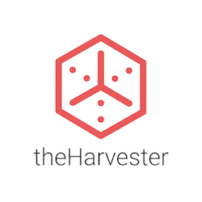

# theHarvester



[](https://github.com/laramies/theHarvester/actions/workflows/theHarvester.yml)
[](https://github.com/laramies/theHarvester/actions/workflows/dockerci.yml)

theHarvester gathers open-source intelligence about a domain or organization from search engines, certificate transparency logs, DNS datasets, code repositories, threat-intelligence platforms, and other public sources.

It is built for the early reconnaissance stage of authorized security assessments. Use it only on targets you own or have explicit permission to test.

## Why theHarvester

- **Broad discovery coverage:** combine many independent sources in one run instead of querying each provider manually.
- **Useful result types:** collect hostnames, email addresses, IP addresses, URLs, ASNs, and people.
- **Enrichment after discovery:** optionally resolve DNS, query Shodan, check for subdomain takeovers, brute-force DNS names, scan common API paths, and capture screenshots.
- **CLI and browser-accessible API:** use the command line interactively or run the FastAPI service for automation and interactive Swagger/ReDoc documentation.
- **Repeatable output:** print results, write JSON and XML reports, and retain host, email, and IP findings in a local SQLite database.
- **Operational controls:** select individual sources, set result limits, use HTTP or SOCKS proxies, choose DNS resolvers, and suppress missing-key noise.

Source availability, quotas, and response formats are controlled by third parties and can change independently of theHarvester.

## Quick start

theHarvester requires Python 3.12 or newer and uses [uv](https://docs.astral.sh/uv/) for dependency management.

```bash
curl -LsSf https://astral.sh/uv/install.sh | sh
git clone https://github.com/laramies/theHarvester.git
cd theHarvester
uv sync
uv run theHarvester -d example.com -b crtsh,certspotter
```

See the [installation guide](https://github.com/laramies/theHarvester/wiki/Installation) for platform-specific setup and packaged distributions.

## Common workflows

Query several passive sources:

```bash
uv run theHarvester -d example.com -b crtsh,certspotter,commoncrawl
```

Save both JSON and XML reports:

```bash
uv run theHarvester -d example.com -b crtsh,certspotter -f report
```

Resolve discovered hosts with the default resolver list:

```bash
uv run theHarvester -d example.com -b crtsh,certspotter -r
```

List every option and its current behavior:

```bash
uv run theHarvester -h
```

### Active features

Options such as DNS brute force (`-c`), reverse DNS lookup (`-n`), takeover checks (`-t`), API endpoint scanning (`-a`), DNS resolution (`-r`), and screenshots (`--screenshot`) generate additional network activity. Use them only within an explicitly authorized scope.

Screenshot capture also requires a Playwright-compatible browser; see the installation guide for setup.

## Browser interface and REST API

`restfulHarvest` starts a FastAPI service on `127.0.0.1:5000` by default:

```bash
uv run restfulHarvest
```

Open [http://127.0.0.1:5000/docs](http://127.0.0.1:5000/docs) for interactive Swagger documentation or [http://127.0.0.1:5000/redoc](http://127.0.0.1:5000/redoc) for ReDoc.

| Route | Purpose |
| --- | --- |
| `GET /sources` | List registered discovery sources. |
| `GET /query` | Return ASNs, interesting URLs, Twitter/LinkedIn fields, Trello URLs, IPs, emails, and hosts as JSON. |
| `GET /dnsbrute` | Run DNS brute force for a domain. |
| `POST /additional/breaches` | Return Have I Been Pwned breach data. |
| `POST /additional/leaks` | Return Leak-Lookup data. |
| `POST /additional/security-score` | Return SecurityScorecard data. |
| `POST /additional/tech-stack` | Return BuiltWith technology data. |
| `POST /additional/all` | Run all additional API lookups. |

The service rate limit defaults to five requests per minute and can be changed with `--rate-limit`. The `/additional/*` routes require `THEHARVESTER_API_KEY` on the server and the same value in the `X-API-Key` request header.

The core `/query`, `/sources`, and `/dnsbrute` routes are not authenticated. Keep the service bound to localhost unless you place it behind appropriate authentication, access controls, and TLS. Docker Compose publishes port `5000` on every host interface unless you narrow the port mapping:

```bash
docker compose up --build
```

## Discovery sources

Saved JSON reports expose separate fields for hosts, emails, IP addresses, ASNs, URLs or links, and people when those results are available. The result-type columns below describe only that consolidated CLI report. They do not include every field parsed from a provider response. Empty fields may be omitted, and reports do not retain per-source attribution.

A checkmark means the current CLI can add that result type to its consolidated report. The **Separate output** column identifies REST endpoints or optional actions whose results are not part of those source columns. **Configured** means the repository provides an `api-keys.yaml` setting for that source; it does not guarantee that every provider request requires a paid key.

<details>
<summary><strong>View the source and result matrix</strong></summary>

| Source | Hosts | Emails | IPs | ASNs | URLs / links | People | Separate REST/action output (not consolidated report) | API key setting |
| --- | :---: | :---: | :---: | :---: | :---: | :---: | --- | :---: |
| `baidu` | ✓ | ✓ | — | — | — | — | — | None |
| `bevigil` | ✓ | — | — | — | ✓ | — | — | Configured |
| `bitbucket` | ✓ | ✓ | — | — | — | — | — | Configured |
| `bufferoverun` | ✓ | — | ✓ | — | — | — | — | Configured |
| `builtwith` | ✓ | — | — | — | ✓ | — | `POST /additional/tech-stack` response | Configured |
| `brave` | ✓ | ✓ | — | — | — | — | — | Configured |
| `censys` | ✓ | ✓ | — | — | — | — | — | Configured |
| `certspotter` | ✓ | — | — | — | — | — | — | None |
| `chaos` | ✓ | — | — | — | — | — | — | Configured |
| `commoncrawl` | ✓ | — | — | — | — | — | — | None |
| `criminalip` | ✓ | — | ✓ | ✓ | — | — | — | Configured |
| `crtsh` | ✓ | — | — | — | — | — | — | None |
| `dehashed` | — | — | ✓ | — | — | — | — | Configured |
| `dnsdumpster` | ✓ | — | ✓ | — | — | — | — | Configured |
| `duckduckgo` | ✓ | ✓ | — | — | — | — | — | None |
| `dymo` | ✓ | — | — | — | — | — | — | Configured |
| `fofa` | ✓ | — | ✓ | — | — | — | — | Configured |
| `fullhunt` | ✓ | — | — | — | — | — | — | Configured |
| `github-code` | ✓ | ✓ | — | — | — | — | — | Configured |
| `gitlab` | ✓ | ✓ | — | — | — | — | — | None |
| `hackertarget` | ✓ | — | — | — | — | — | — | Configured |
| `haveibeenpwned` | — | — | — | — | — | — | `POST /additional/breaches` response | Configured |
| `hudsonrock` | ✓ | ✓ | ✓ | — | — | — | — | None |
| `hunter` | ✓ | ✓ | — | — | — | — | — | Configured |
| `hunterhow` | ✓ | — | — | — | — | — | — | Configured |
| `intelx` | — | ✓ | — | — | ✓ | — | — | Configured |
| `leakix` | ✓ | ✓ | — | — | — | — | — | Configured |
| `leaklookup` | — | ✓ | — | — | — | — | `POST /additional/leaks` response | Configured |
| `mojeek` | ✓ | ✓ | — | — | — | — | — | Configured |
| `netlas` | ✓ | — | — | — | — | — | — | Configured |
| `onyphe` | ✓ | — | ✓ | ✓ | — | — | — | Configured |
| `otx` | ✓ | — | ✓ | — | — | — | — | None |
| `pentesttools` | ✓ | — | — | — | — | — | — | Configured |
| `projectdiscovery` | ✓ | — | — | — | — | — | — | Configured |
| `rapiddns` | ✓ | — | — | — | — | — | — | None |
| `robtex` | ✓ | — | ✓ | — | — | — | — | None |
| `rocketreach` | — | ✓ | — | — | ✓ | — | — | Configured |
| `securityscorecard` | ✓ | — | ✓ | — | — | — | `POST /additional/security-score` response | Configured |
| `securityTrails` | ✓ | — | ✓ | — | — | — | — | Configured |
| `sherlockeye` | ✓ | ✓ | ✓ | — | — | — | — | Configured |
| `shodan` | ✓ | — | — | — | — | — | `-s` / `--shodan` host-enrichment output | Configured |
| `shodanInternetDB` | ✓ | — | ✓ | — | — | — | — | None |
| `subdomaincenter` | ✓ | — | — | — | — | — | — | None |
| `subdomainfinderc99` | ✓ | — | — | — | — | — | — | None |
| `thc` | ✓ | — | — | — | — | — | — | None |
| `threatcrowd` | ✓ | — | ✓ | — | — | — | — | None |
| `tomba` | ✓ | ✓ | — | — | — | — | — | Configured |
| `urlscan` | ✓ | — | ✓ | ✓ | ✓ | — | — | None |
| `venacus` | — | ✓ | ✓ | — | ✓ | ✓ | — | Configured |
| `virustotal` | ✓ | — | — | — | — | — | — | Configured |
| `waybackarchive` | ✓ | — | — | — | — | — | — | None |
| `whoisxml` | ✓ | — | — | — | — | — | — | Configured |
| `windvane` | ✓ | ✓ | ✓ | — | — | — | — | Configured |
| `yahoo` | ✓ | ✓ | — | — | — | — | — | None |
| `zoomeye` | ✓ | ✓ | ✓ | ✓ | ✓ | — | — | Configured |

</details>

Provider pricing is intentionally omitted because plans and quotas change frequently. See the [API-key installation guide](https://github.com/laramies/theHarvester/wiki/Installation#api-keys) and each provider's current documentation.

The runtime registry also reports the legacy identifiers `linkedin`, `linkedin_links`, `netcraft`, `omnisint`, `sublist3r`, and `zoomeyeapi`. They have no active CLI handlers in the current code and are therefore not presented as usable sources in this table.

## Configuration

On first use, theHarvester creates default configuration files under `~/.theHarvester/`. It also reads system configuration from `/etc/theHarvester/` and `/usr/local/etc/theHarvester/`.

- `api-keys.yaml` stores provider credentials.
- `proxies.yaml` configures HTTP and SOCKS5 proxies used with `-p`.

Never commit populated configuration files, API keys, account details, or provider responses.

## Results and local data

- Terminal output shows consolidated findings. Separately selected actions, such as `-s` / `--shodan`, may print their own enrichment.
- `-f NAME` writes `NAME.json` and `NAME.xml`.
- Screenshots are written to the directory passed to `--screenshot`.
- Host, email, IP, and related scan records are stored in `~/.local/share/theHarvester/stash.sqlite`.
- REST queries return JSON.

Treat collected OSINT as potentially sensitive. Keep report files, screenshots, and the local database out of source control and share them only within the authorized engagement.

## Development and contributing

Read [CONTRIBUTING.md](CONTRIBUTING.md) for the development setup, required checks, testing expectations, and pull-request process.

## Support and credits

- Use [GitHub Issues](https://github.com/laramies/theHarvester/issues) for reproducible bugs and focused feature requests.
- Christian Martorella created theHarvester.
- Jay Townsend and Matthew Brown maintain and develop the project.
- Lee Baird is a main contributor.
- Thanks to John Matherly for Shodan and Ahmed Aboul Ela for the bundled subdomain dictionaries.
