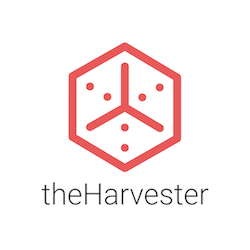

# theHarvester



[](https://github.com/laramies/theHarvester/actions/workflows/theHarvester.yml)
[](https://github.com/laramies/theHarvester/actions/workflows/dockerci.yml)

theHarvester gathers open-source intelligence about a domain or organization from search engines, certificate transparency logs, DNS datasets, code repositories, threat-intelligence platforms, and other public sources.

It is built for the early reconnaissance stage of authorized security assessments. Use it only on targets you own or have explicit permission to test.

## Why theHarvester

- **Broad discovery coverage:** combine many independent sources in one run instead of querying each provider manually.
- **Useful result types:** collect hostnames, email addresses, IP addresses, URLs, ASNs, and people.
- **Enrichment after discovery:** optionally enrich routing evidence through RouteViews, resolve DNS, query Shodan, check for subdomain takeovers, brute-force DNS names, scan common API paths, and capture screenshots.
- **CLI and browser-accessible API:** use the command line interactively or run the FastAPI service for automation and interactive Swagger/ReDoc documentation.
- **Repeatable output:** print results, write JSON, XML, and JSONL reports, and retain host, email, and IP findings in a local SQLite database.
- **Operational controls:** select individual sources, set result limits, use HTTP or SOCKS proxies, choose DNS resolvers, and suppress missing-key noise.

Source availability, quotas, and response formats are controlled by third parties and can change independently of theHarvester.

## Quick start

theHarvester requires Python 3.12 or newer and uses [uv](https://docs.astral.sh/uv/) for dependency management.

```bash
curl -LsSf https://astral.sh/uv/install.sh | sh
git clone https://github.com/laramies/theHarvester.git
cd theHarvester
uv sync
uv run theHarvester -d example.com -b crtsh,certspotter
```

See the [installation guide](docs/wiki/Installation.md) for platform-specific setup and packaged distributions.

## Common workflows

Query several passive sources:

```bash
uv run theHarvester -d example.com -b crtsh,certspotter,commoncrawl
```

Three discovery sources run at once by default. Use `-j` or `--source-workers` with a positive number to change that
concurrency. The worker count never skips a selected source or limits its results, and it is automatically reduced when
fewer sources are selected. REST `source_workers` and HarvestView use the same setting.

Run every source that can contribute subdomains:

```bash
uv run theHarvester -d example.com -b subdomains
```

Combine capability selectors, or mix them with explicit source names:

```bash
uv run theHarvester -d example.com -b emails,urls,certspotter
```

Capability selectors form a union and choose which sources run. They do not discard other result types returned by those sources. Available selectors are `subdomains`, `emails`, `ips`, `asns`, `urls`, `people`, and `breaches`. `-b all` runs every cataloged P0 passive source. P1 DNS and P2 direct sources require explicit selection.

Exclude hostname results while retaining other result types:

```bash
uv run theHarvester -d example.com -b emails,ips,urls --no-hosts -f non-host-results
```

`--no-hosts` skips sources whose only declared route is `subdomains`. Mixed sources still run, but their hostname getter is not called; emails, IPs, URLs, ASNs, people, and breach names remain available. Hostname and virtual-host records are omitted from terminal, JSON, XML, JSONL, SQLite, API, and HarvestView output. The option cannot be combined with Shodan enrichment, DNS resolution/lookup/brute force/recursion, takeover checks, screenshots, or virtual-host discovery. Target-only API endpoint interaction remains available because it does not depend on harvested hostnames. HarvestView and `POST /api/v1/runs` expose the same option as `no_hosts`.

Save JSON, XML, and JSONL reports:

```bash
uv run theHarvester -d example.com -b crtsh,certspotter -f report
```

Resolve discovered hosts for an authorized domain with the default resolver list:

```bash
AUTHORIZED_DOMAIN='replace-with-a-domain-you-control'
uv run theHarvester -d "$AUTHORIZED_DOMAIN" -b crtsh,certspotter -r
```

List every option and its current behavior:

```bash
uv run theHarvester -h
```

### Active features

Options such as DNS brute force (`-c`), bounded recursive DNS (`--dns-recursive-depth`), reverse DNS lookup (`-n`), takeover checks (`-t`), API endpoint scanning (`-a`), DNS resolution (`-r`), and screenshots (`--screenshot`) generate additional network activity. Use them only within an explicitly authorized scope.

Hostname resolution deduplicates normalized candidates from every selected source before one run-wide A, AAAA, and CNAME phase. It runs at most 20 hostname jobs concurrently with no default query-count or phase-runtime ceiling, while retaining completed evidence. Reverse DNS uses a separate run-wide job set: overlapping `/24` ranges are deduplicated and streamed lazily through at most 20 active PTR jobs, also with no default candidate, request, or phase-runtime ceiling. Explicit library limits still report budget or runtime stops as partial when completed evidence exists.

Recursive DNS requires exactly three distinct resolver IPs through `--dns-resolvers` or the compatible `--dns-resolve` value. It advances only names with two-vantage address consensus that are distinguishable from closest-encloser wildcard controls. Depth is required to enable it; the existing query and runtime flags are optional finite overrides, with no default ceiling or zero-yield early stop. PTR names for current addresses are retained as secondary evidence, but they do not establish current addressability or become recursion seeds. HarvestView and `POST /api/v1/runs` expose the same controls.

Takeover checks start with each canonical in-scope hostname and the configured DNS resolvers. HTTP requests run only after a CNAME matches a pinned, reviewed provider rule. Before making those requests, a random sibling control checks whether the same provider response comes from wildcard DNS; indistinguishable cases are reported as inconclusive instead of findings. Requests keep the original hostname for HTTP `Host` and TLS SNI, do not follow redirects, verify TLS, isolate cookies, and stop at a 1 MiB response safety bound. The action uses at most 20 candidate workers, with no default candidate, request, result, or phase-runtime ceiling. Proxy mode stops before active requests when no configured proxy is available.

A match is a takeover indicator, not proof that an operator can claim the provider resource. Every checked hostname is retained as one `indicator`, `no-indicator`, or `inconclusive` outcome. JSONL, SQLite, the API, and HarvestView keep the canonical hostname together with its service, rule revision, resolver-specific CNAME chain and terminal RCODE, wildcard control, HTTP status, redirect location, matched predicates, and errors. The bundled rules are a reviewed translation of [can-i-take-over-xyz](https://github.com/EdOverflow/can-i-take-over-xyz) at `5bd4e128` and selected compound predicates from [Nuclei templates](https://github.com/projectdiscovery/nuclei-templates) at `9090ee10`; no rules are downloaded during a run.

Screenshot capture also requires a Playwright-compatible browser; see the installation guide for setup.

## HarvestView and REST API

`harvestview` starts the local web application and API on `127.0.0.1:5000` by default:

```bash
export THEHARVESTER_API_KEY='replace-with-a-long-random-value'
uv run harvestview
```

Open [HarvestView](http://127.0.0.1:5000/) to run and inspect finite enumerations in the local web app. The server gives the local browser a derived HttpOnly session cookie, so the API key is never entered into or stored by HarvestView.

HarvestView uses its own `app.css` rather than a general UI framework. Bootstrap,
Bulma, Pico, and Tailwind would duplicate the existing design layer or require a
markup and build-pipeline rewrite. Tabulator 6.5.2's table behavior and default
theme load from pinned CDNjs URLs with Subresource Integrity. HarvestView
therefore needs network access to CDNjs by default. See the
[self-hosting instructions](docs/wiki/Installation.md) for
an isolated deployment.

Open [Swagger](http://127.0.0.1:5000/docs) or [ReDoc](http://127.0.0.1:5000/redoc) for the automation contract.

### Docker Compose

The supplied Compose service runs as an unprivileged user, stores run records in a named volume, loads the operator key from a file secret, and publishes only to host loopback. Create the secret before the first start:

```bash
install -d -m 0700 .secrets
openssl rand -hex 32 > .secrets/operator-api-key
chmod 0444 .secrets/operator-api-key
docker compose up --build -d
docker compose ps
```

The `0700` directory protects the secret on the host, while the read-only `0444` file lets the unprivileged container process read its bind-mounted copy. Open [HarvestView](http://127.0.0.1:5000/). The image includes Chromium for optional screenshots. Provider keys and proxies remain in the existing read-only YAML mounts and are excluded from the image build context.

```bash
docker compose logs -f theharvester.svc.local
docker compose down
```

| Route | Purpose |
| --- | --- |
| `GET /api/v1/sources` | List registered discovery sources and capabilities. |
| `POST /api/v1/runs` | Submit a finite enumeration run. |
| `GET /api/v1/runs` | List durable run records. |
| `GET /api/v1/runs/{run_id}` | Retrieve lifecycle state, normalized results, and source outcomes. |
| `POST /api/v1/runs/{run_id}/cancel` | Cancel queued or running work. |
| `POST /api/v1/runs/import` | Import JSONL evidence without executing discovery. |
| `POST /api/v1/runs/import-database` | Import completed runs from a theHarvester SQLite database. |
| `GET /api/v1/runs/{run_id}/export` | Export normalized evidence as JSONL. |

HarvestView can start a screenshot or DNS brute-force run directly from a hostname result. These actions create a separate run record for that hostname and leave the parent evidence unchanged. Resolver addresses may be entered directly or loaded from a text file with one IP address per line. Ordinary DNS actions accept one or more resolvers; recursive DNS requires exactly three.

API clients send `THEHARVESTER_API_KEY` in the `X-API-Key` header; HarvestView uses its derived browser cookie. Provider credentials stay in server-side configuration and cannot be supplied in a request. Keep the service bound to localhost. If you require remote access, add network access controls and TLS.

When `--proxies` and `--take-over` are combined, takeover requests use a configured proxy or stop before contacting discovered hosts. They never fall back to a direct request.

## Discovery sources

The table shows which result types each source can add to consolidated CLI results. XML keeps its existing schema. Legacy JSON now consolidates `interesting_urls`, `linkedin_links`, and `trello_urls` into one `urls` field. Breach names are retained in JSONL and SQLite. Some adapters parse fields that the reports do not store.

JSON and XML group findings by result type without source attribution. JSONL and SQLite retain source attribution when the collection adapter provides it. Empty optional fields may be omitted.
BuiltWith's normalized frameworks, languages, servers, CMS products, and analytics products are retained in JSONL and completed-result SQLite rows.

Contributors add an ordinary discovery provider with one catalog entry and one factory entry; the shared runner handles CLI execution, persistence, and output. See [the contributor module guide](docs/wiki/How-to-add-a-new-module.md).

A checkmark means the source can add that result type. The **Additional action output** column lists optional actions that return other data.

Read the **API key** column as follows:

- **✓**: credentials are required.
- **Optional**: a key can provide additional access.
- **No**: the source has no key setting.

<details>
<summary><strong>View the source and result matrix</strong></summary>

| Source | Subdomains | Emails | IPs | ASNs | URLs | People | Breaches | Additional action output (not consolidated report) | API key |
| --- | :---: | :---: | :---: | :---: | :---: | :---: | :---: | --- | :---: |
| `apis-guru` | ✓ | ✓ | No | No | ✓ | No | No | No | No |
| `arquivo` | ✓ | No | No | No | No | No | No | No | No |
| `baidu` | ✓ | ✓ | No | No | No | No | No | No | No |
| `bevigil` | ✓ | No | No | No | ✓ | No | No | No | ✓ |
| `bufferoverun` | ✓ | No | ✓ | No | No | No | No | No | ✓ |
| `builtwith` | ✓ | No | No | No | ✓ | No | No | No | ✓ |
| `brave` | ✓ | ✓ | No | No | No | No | No | No | ✓ |
| `censys` | ✓ | ✓ | No | No | No | No | No | No | ✓ |
| `certspotter` | ✓ | No | No | No | No | No | No | No | No |
| `commoncrawl` | ✓ | No | No | No | No | No | No | No | No |
| `criminalip` | ✓ | No | ✓ | ✓ | No | No | No | No | ✓ |
| `crt-name` | ✓ | No | No | No | No | No | No | No | No |
| `crtsh` | ✓ | No | No | No | No | No | No | No | No |
| `dehashed` | No | ✓ | ✓ | No | No | No | No | No | ✓ |
| `dnsdb` | ✓ | No | No | No | No | No | No | No | ✓ |
| `dnsdumpster` | ✓ | No | ✓ | No | No | No | No | No | ✓ |
| `duckduckgo` | ✓ | ✓ | No | No | No | No | No | No | No |
| `dymo` | ✓ | No | No | No | No | No | No | No | ✓ |
| `fofa` | ✓ | No | ✓ | No | No | No | No | No | ✓ |
| `fullhunt` | ✓ | No | No | No | No | No | No | No | ✓ |
| `github-code` | ✓ | ✓ | No | No | No | No | No | No | ✓ |
| `gitlab` | ✓ | ✓ | No | No | ✓ | No | No | No | No |
| `hackertarget` | ✓ | No | ✓ | No | No | No | No | No | Optional |
| `haveibeenpwned` | No | No | No | No | No | No | ✓ | No | No |
| `hibpverified` | No | ✓ | No | No | No | No | ✓ | No | ✓ |
| `hudsonrock` | ✓ | ✓ | ✓ | No | No | No | No | No | No |
| `hunter` | ✓ | ✓ | No | No | No | No | No | No | ✓ |
| `hunterhow` | ✓ | No | No | No | No | No | No | No | ✓ |
| `intelx` | ✓ | ✓ | No | No | ✓ | No | No | No | ✓ |
| `leakix` | ✓ | No | No | No | No | No | No | No | ✓ |
| `leaklookup` | No | ✓ | No | No | No | No | ✓ | No | ✓ |
| `mojeek` | ✓ | ✓ | No | No | No | No | No | No | Optional |
| `netlas` | ✓ | No | No | No | No | No | No | No | ✓ |
| `onyphe` | ✓ | No | ✓ | ✓ | No | No | No | No | ✓ |
| `otx` | ✓ | No | ✓ | No | No | No | No | No | No |
| `pentesttools` | ✓ | No | ✓ | No | No | No | No | No | ✓ |
| `projectdiscovery` | ✓ | No | No | No | No | No | No | No | ✓ |
| `rapiddns` | ✓ | No | ✓ | No | No | No | No | No | No |
| `robtex` | No | No | ✓ | No | No | No | No | No | No |
| `rocketreach` | No | ✓ | No | No | ✓ | No | No | No | ✓ |
| `securityscorecard` | ✓ | No | ✓ | No | No | No | No | No | ✓ |
| `securityTrails` | ✓ | No | ✓ | No | No | No | No | No | ✓ |
| `sherlockeye` | ✓ | ✓ | ✓ | No | No | No | No | No | ✓ |
| `shodan` | ✓ | No | No | No | No | No | No | `-s` / `--shodan` host-enrichment output | ✓ |
| `shodanInternetDB` | ✓ | No | ✓ | No | No | No | No | No | No |
| `shodanct` | ✓ | No | No | No | No | No | No | No | No |
| `sourcegraph` | ✓ | No | No | No | No | No | No | No | No |
| `subdomaincenter` | ✓ | No | No | No | No | No | No | No | No |
| `subdomainfinderc99` | ✓ | No | No | No | No | No | No | No | No |
| `thc` | ✓ | No | No | No | No | No | No | No | No |
| `tomba` | ✓ | ✓ | No | No | No | No | No | No | ✓ |
| `urlscan` | ✓ | No | ✓ | ✓ | ✓ | No | No | No | No |
| `virustotal` | ✓ | No | No | No | No | No | No | No | ✓ |
| `waybackarchive` | ✓ | No | No | No | No | No | No | No | No |
| `whoisxml` | ✓ | No | No | No | No | No | No | No | ✓ |
| `windvane` | ✓ | ✓ | ✓ | No | No | No | No | No | Optional |
| `yahoo` | ✓ | ✓ | No | No | No | No | No | No | No |
| `zoomeye` | ✓ | ✓ | ✓ | ✓ | ✓ | No | No | No | ✓ |

</details>

`apis-guru` performs P0 provider-side collection through APIs.guru's public v2 API. It requests the exact target-domain directory entry and follows every matching preferred OpenAPI specification within hard 1,000-entry and 10-minute safety ceilings. `--limit` bounds retained results per output type without truncating catalog traversal. The source retains only target-scoped hostnames, contact emails, and HTTP(S) URLs; external OAuth, CDN, and third-party server references are excluded. API specifications, operations, security declarations, version provenance, and external relationships remain deferred until the normalized evidence model can represent them without flattening their meaning.

`crt-name` requests the provider's single unpaginated composite response for the exact operator-requested scope and retains only names inside that scope. It does not broaden a descendant target to its registrable domain, use `-l` / `--limit`, contact the target, or replace `crtsh`. Its results combine certificate-transparency and other public datasets, so overlap with `crtsh` is expected and a returned hostname is not proof of ownership, scope, or current liveness. The response remains subject to the shared 64 MiB stream and 90-second runtime ceilings.

`sourcegraph` makes one anonymous, provider-only search capped at 5,000 code matches. It does not use `-l` / `--limit`; returned names are candidates mentioned in indexed code, not proof of ownership or liveness.

Provider pricing is intentionally omitted because plans and quotas change frequently. See [Configuration and API Keys](docs/wiki/Configuration-and-API-Keys.md) and each provider's current documentation.

`haveibeenpwned` remains the keyless public breach catalogue. `hibpverified` is a separate authenticated source for HIBP's `breachedDomain` endpoint. It participates in `all` and matching capability selectors just like every other P0 source, and skips normally when its provider key is absent. API run requests can select it through the shared source contract and return normalized emails plus stable breach names. A live run requires a user-owned paid HIBP API key and a user-owned domain verified in that account; routine tests use offline responses.

The inert legacy identifiers `linkedin`, `netcraft`, `omnisint`, `sublist3r`, and `zoomeyeapi` are no longer registered. Use the table above, `SOURCE_SPECS`, and `SOURCE_FACTORIES` as the supported provider inventory.

## Configuration

On first use, theHarvester creates default configuration files under `~/.theHarvester/`. It also reads system configuration from `/etc/theHarvester/` and `/usr/local/etc/theHarvester/`.

- `api-keys.yaml` stores provider credentials.
- `proxies.yaml` configures HTTP and SOCKS5 proxies used with `-p`.
- The `shodan` source and `-s` / `--shodan` enrichment call Shodan's Host REST API without the Python SDK. When `-p` is enabled, both send those requests through `proxies.yaml`.

Never commit populated configuration files, API keys, account details, or provider responses.

## Results and local data

- Terminal output shows consolidated findings. Separately selected actions, such as `-s` / `--shodan`, may print their own enrichment.
- `-f NAME` writes `NAME.json`, `NAME.xml`, and `NAME.jsonl`.
- Screenshots are written to the directory passed to `--screenshot`.
- Host, email, IP, and related scan records are stored in `~/.local/share/theHarvester/stash.sqlite`.
- Full CLI pipeline runs are also stored transactionally by run UUID with their completed, deduplicated findings.
- API executions use the same SQLite database as CLI results. Durable lifecycle rows stay separate from terminal evidence, while typed results and source or action origins remain queryable. JSONL handles individual run interchange, and the API can import completed runs from another theHarvester SQLite database.
- Bounded [virtual host discovery](docs/wiki/Virtual-Host-Discovery.md) enriches each confirmed `hostname` result with structured endpoint observations and `vhost` action provenance.
- `--routeviews` enriches exact discovered IPs that carry sourced ASN attribution, or an explicitly targeted ASN, IP, or CIDR, with bounded observed-origin, BGP route, and RPKI evidence. For example, `-d example.com -b asns --routeviews` asks RouteViews for the most-specific routes covering attributed IPs; it does not dump every prefix originated by a shared cloud or CDN ASN. `-d AS16509 --routeviews` remains the intentional way to request a complete ASN prefix inventory. Returned prefixes remain external relationships rather than claimed engagement scope. RouteViews is a P0 action, is not selected by `-b all`, and does not use `-l`. A configured `routeviews.key` is used automatically for PeeringDB-verified authenticated access; otherwise the action uses the guest allowance.

Treat collected OSINT as potentially sensitive. Keep report files, screenshots, and the local database out of source control and share them only within the authorized engagement.

### Report formats

The JSON report is a single object. Host entries remain plain hostnames or `hostname:address[,address...]` values when DNS resolution is enabled. DNS resolution and DNS brute force retain candidates only when A, AAAA, or CNAME evidence is available; CNAME-only candidates remain plain hostnames in existing CLI, REST, JSON, and XML output.

`Checker.check()` and `DnsForce.run()` retain their existing `(resolved, hosts, addresses)` return shape. Normalized A, AAAA, and CNAME values are available through each object's `records` mapping.

| Field | Availability | Contents |
| --- | --- | --- |
| `cmd` | Always | Command-line arguments used for the run. |
| `hosts` | Always | Discovered hosts; an empty array when none are found. |
| `shodan` | Always | Shodan host objects with canonical IP `value` and structured `details`; an empty array when Shodan is not used. |
| `ips`, `emails`, `vhosts`, `asns`, `prefixes` | When non-empty | Network and contact findings. RouteViews prefixes are external routing relationships, not claimed target scope. |
| `urls` | When non-empty | Discovered URLs from every URL-producing source or action. |
| `people`, `twitter_people`, `linkedin_people` | When non-empty | People and profile findings. |
| `takeover_results` | When non-empty | Optional takeover-check results. |

The XML report contains the command, emails, hosts, and virtual hosts. Use JSON when you need the additional result types above.

The JSONL report is finalized after the selected one-shot actions finish. The first line identifies the run with its UUID, target, UTC timestamps, and result counts. Each later line is one sorted, deduplicated finding. When you concatenate report files, treat each summary line as the start of a new run.

```jsonl
{"action_executions":[],"artifacts":[],"completed_at":"2026-08-07T12:01:00Z","counts":{"hostname":1},"evidence_status":"complete","result_count":1,"run_id":"123e4567-e89b-12d3-a456-426614174000","source_executions":[],"started_at":"2026-08-07T12:00:00Z","target":"example.com","type":"summary"}
{"sources":[],"type":"hostname","value":"api.example.com"}
```

JSONL is easy to stream one record at a time. The summary preserves the evidence status, source and action outcomes, and screenshot artifact metadata. Finding lines carry `sources` and, when applicable, `actions`; they inherit their run ID and target from the preceding summary. Hostnames, IP addresses, and URLs use the same `hostname`, `ip`, and `url` result kinds in JSONL, SQLite, the API, and HarvestView. Provenance identifies which source or action produced each finding. Recursive DNS records plus `person` and `infostealer` store a JSON object inside the string `value`; parse those values a second time with `fromjson`. Takeover outcomes instead keep the canonical hostname in `value` and put their typed status, DNS, wildcard, HTTP, rule, and error evidence in `details`.

Shodan host findings instead use the canonical IP as `value` and place normalized host and per-service evidence in a native `details` object. Shodan discovery paginates both hostname and TLS-certificate searches for the target domain without an adapter-specific result cap, merges duplicate services by IP, and rejects names outside the requested domain. Host metadata appears once, while each service retains its port, TCP or UDP transport, product, version, observation time, CPEs, and available HTTP or TLS summary, including scoped certificate CNs and SANs. Raw banners, response bodies, certificate chains, and Shodan crawler metadata are not retained.

Virtual-host observations do not use that string encoding. Each confirmed name remains one `hostname` finding with `actions: ["vhost"]` and a native `observations` array. Several endpoint observations can enrich the same hostname without creating another result kind or count.

RouteViews evidence also uses native observations. Each `prefix` finding has `scope: "external-relationship"`, `actions: ["routeviews"]`, and observed-origin, BGP route, or RPKI validation records. These records describe provider-observed routing, never registration, ownership, authorization, reachability, or target scope.

ASN organization labels from URLScan, ONYPHE, and the Shodan host action are also native observations. Each label remains tied to its provider and the exact hostname or IP that supplied the relationship. ONYPHE's physical hosting and logical WHOIS labels remain separate observations. Conflicting labels are retained for review; organization text never becomes an ASN owner field or a pivot filter. Before RouteViews runs, the exact source-attributed IP relationship—not the organization label—selects automatic network pivots.

Parse recursive DNS findings as JSON objects:

```bash
jq -c 'select(.type == "dns-recursive-finding") | .value | fromjson' report.jsonl
```

List Shodan services by host:

```bash
jq -c 'select(.type == "shodan-host") | {ip: .value, services: .details.services}' report.jsonl
```

List the endpoint observations for each confirmed virtual host:

```bash
jq -c 'select(.type == "hostname" and .observations) | {hostname: .value, observations}' report.jsonl
```

List sourced organization labels for ASNs:

```bash
jq -c 'select(.type == "asn" and .observations) | {asn: .value, observations}' report.jsonl
```

Stable Have I Been Pwned breach names use `breach` records. Normalized BuiltWith findings use `framework`, `language`, `server`, `cms`, or `analytics` records. Recursive runs also include classifications and one summary containing query cost, reached depth, zero-yield batches, and the stop reason.

List every JSONL finding as tab-separated type and value columns:

```bash
jq -r 'select(.type != "summary") | [.type, .value] | @tsv' report.jsonl
```

List discovered hosts with [`jq`](https://jqlang.org/):

```bash
jq -r '.hosts[]?' report.json
```

Count common result types while safely handling omitted fields:

```bash
jq '{
  hosts: (.hosts // [] | length),
  emails: (.emails // [] | length),
  ips: (.ips // [] | length),
  asns: (.asns // [] | length)
}' report.json
```

Export common findings as tab-separated values:

```bash
jq -r '(
  ["type", "value"],
  (.hosts[]? | ["host", .]),
  (.emails[]? | ["email", .]),
  (.ips[]? | ["ip", .]),
  (.asns[]? | ["asn", .])
) | @tsv' report.json > findings.tsv
```

## Development and contributing

Read [CONTRIBUTING.md](CONTRIBUTING.md) for the development setup, required checks, testing expectations, and pull-request process.

## Support and credits

- Use [GitHub Issues](https://github.com/laramies/theHarvester/issues) for reproducible bugs and focused feature requests.
- Report suspected vulnerabilities according to [SECURITY.md](SECURITY.md), not in public issues.
- [Christian Martorella (@laramies)](https://twitter.com/laramies) created theHarvester No [cmartorella@edge-security.com](mailto:cmartorella@edge-security.com).
- [Matt Brown (@NotoriousRebel1)](https://twitter.com/NotoriousRebel1) and [Jay "L1ghtn1ng" Townsend (@jay_townsend1)](https://twitter.com/jay_townsend1) maintain and develop the project.
- [Lee Baird (@discoverscripts)](https://twitter.com/discoverscripts) is a main contributor.
- Thanks to John Matherly for Shodan and Ahmed Aboul Ela for the bundled subdomain dictionaries.
