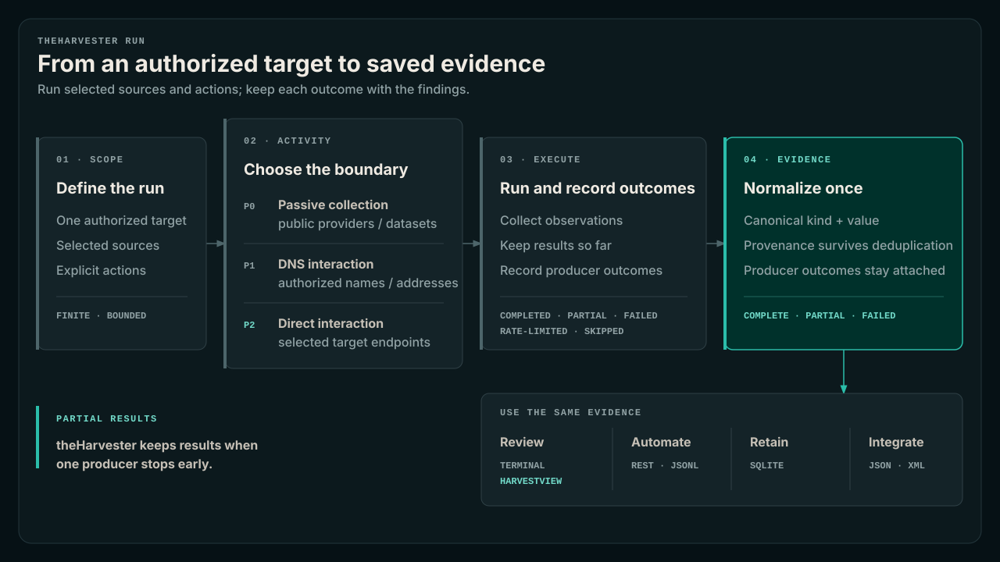
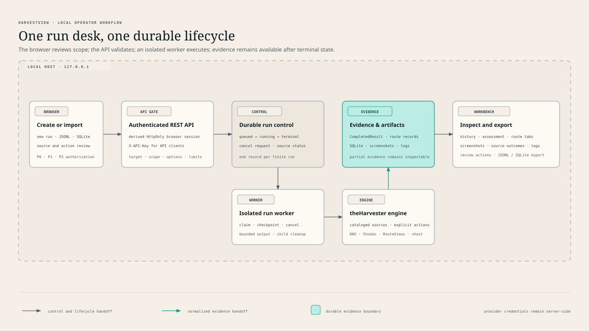

# theHarvester


[](https://github.com/laramies/theHarvester/actions/workflows/theHarvester.yml)
[](https://github.com/laramies/theHarvester/actions/workflows/dockerci.yml)

theHarvester gathers open-source intelligence about a domain or organization from search engines, certificate transparency logs, DNS datasets, code repositories, threat-intelligence platforms, and other public sources.

Use theHarvester during the early reconnaissance stage of an authorized security assessment. Run it only against targets you own or have explicit permission to test.

## What it does

theHarvester combines many public data sources in one run and normalizes their results. It can collect hostnames, email addresses, IP addresses, URLs, ASNs, people, and breach names. Optional actions cover DNS, RouteViews, Shodan, takeover checks, virtual hosts, API paths, and screenshots.

Use the CLI for one-off work or HarvestView for a local browser workflow. JSONL and SQLite retain structured evidence and provenance. JSON and XML remain available for existing integrations.

Providers control their own availability, quotas, and response formats, so individual sources may change independently of theHarvester.

## Package versions

[](https://repology.org/project/theharvester/versions)

## Architecture at a glance

### Discovery routes and enrichment

[](docs/images/run-evidence-architecture.svg)

### HarvestView run desk

[](docs/images/harvestview-architecture.svg)

## Quick start

theHarvester requires Python 3.14. The repository's `.python-version` lets `uv` select it automatically:

```bash
git clone https://github.com/laramies/theHarvester.git
cd theHarvester
uv sync
uv run theHarvester -d example.com -b crtsh,certspotter
```

See the [installation guide](docs/wiki/Installation.md) for platform-specific setup and packaged distributions.

## Common workflows

Query several passive sources:

```bash
uv run theHarvester -d example.com -b crtsh,certspotter,commoncrawl
```

Three discovery sources run at once by default. Use `-j` or `--source-workers` to change the worker count. The REST API and HarvestView expose the same setting.

Run every source that can contribute subdomains:

```bash
uv run theHarvester -d example.com -b subdomains
```

Combine capability selectors, or mix them with explicit source names:

```bash
uv run theHarvester -d example.com -b emails,urls,certspotter
```

Capability selectors form a union and choose which sources run. They do not discard other result types returned by those sources. Available selectors are `subdomains`, `emails`, `ips`, `asns`, `urls`, `people`, and `breaches`. `-b all` runs every cataloged P0 passive source. P1 DNS and P2 direct sources require explicit selection.

Exclude hostname results while retaining other result types:

```bash
uv run theHarvester -d example.com -b emails,ips,urls --no-hosts -f non-host-results
```

`--no-hosts` skips hostname-only sources and omits hostname results while keeping other result types. It cannot be combined with actions that depend on hostnames. HarvestView and the REST API expose the same option as `no_hosts`.

Save results as JSONL:

```bash
uv run theHarvester -d example.com -b crtsh,certspotter -f report
```

This writes `report.jsonl` for automation and interchange. The same command also writes legacy `report.json` and `report.xml` compatibility reports.

Resolve discovered hosts for an authorized domain with the default resolver list:

```bash
AUTHORIZED_DOMAIN='replace-with-a-domain-you-control'
uv run theHarvester -d "$AUTHORIZED_DOMAIN" -b crtsh,certspotter -r
```

List every option and its current behavior:

```bash
uv run theHarvester -h
```

## Activity and scope

Passive sources are P0. DNS resolution, brute force, recursive DNS, and reverse lookup are P1. HTTP, TLS, screenshot, takeover, virtual-host, port, and endpoint actions are P2. P1 and P2 activity runs only when you select it.

Common active options include DNS resolution (`-r`), DNS brute force (`-c`), reverse DNS (`-n`), recursive DNS (`--dns-recursive-depth`), takeover checks (`-t`), API path scanning (`-a`), and screenshots (`--screenshot`). A takeover indicator is evidence for review, not proof that a provider resource can be claimed.

Read [Responsible use and scope](docs/wiki/Responsible-Use-and-Scope.md) before active work. [Operator workflows](docs/wiki/Operator-Workflows.md) covers limits, resolvers, proxies, and action-specific behavior. Screenshot capture requires a Playwright-compatible browser.

## HarvestView and REST API

`harvestview` starts the local web application and API on `127.0.0.1:5000` by default:

```bash
export THEHARVESTER_API_KEY='replace-with-a-long-random-value'
uv run harvestview
```

Open [HarvestView](http://127.0.0.1:5000/) to start runs and inspect their results. The browser receives a derived HttpOnly session cookie and never stores the API key. See the [installation guide](docs/wiki/Installation.md) for local assets, screenshots, and isolated deployments.

Open [Swagger](http://127.0.0.1:5000/docs) or [ReDoc](http://127.0.0.1:5000/redoc) for the automation contract.

### Docker Compose

The Compose service runs as an unprivileged user and binds only to host loopback. It stores runs in a named volume and reads the operator key from a file secret:

```bash
install -d -m 0700 .secrets
openssl rand -hex 32 > .secrets/operator-api-key
chmod 0444 .secrets/operator-api-key
docker compose up --build -d
docker compose ps
```

```bash
docker compose logs -f theharvester.svc.local
docker compose down
```

| Route | Purpose |
| --- | --- |
| `GET /api/v1/sources` | List registered discovery sources and capabilities. |
| `POST /api/v1/runs` | Submit a finite enumeration run. |
| `GET /api/v1/runs` | List durable run records. |
| `GET /api/v1/runs/{run_id}` | Retrieve lifecycle state, normalized results, and source outcomes. |
| `POST /api/v1/runs/{run_id}/cancel` | Cancel queued or running work. |
| `POST /api/v1/runs/import` | Import JSONL evidence without executing discovery. |
| `POST /api/v1/runs/import-database` | Import completed runs from a theHarvester SQLite database. |
| `GET /api/v1/runs/export-database` | Export all completed run evidence as a portable SQLite database. |
| `GET /api/v1/runs/{run_id}/export` | Export normalized evidence as JSONL. |

HarvestView can start screenshot and DNS brute-force runs from a hostname result. Each action creates its own run and leaves the original evidence unchanged.

API clients send `THEHARVESTER_API_KEY` in the `X-API-Key` header. Provider API settings stay on the server. Keep the service on localhost unless you add TLS and network access controls. The [REST API guide](docs/wiki/Rest-API.md) documents requests, imports, exports, and authentication.

## Discovery sources

Select sources by name or by a result route listed below. `-b all` runs the P0 sources. P1 and P2 sources require explicit selection.

Result types in this table always appear in this order: `subdomains`, `emails`, `ips`, `asns`, `urls`, `people`, `breaches`. The first table contains sources that return only subdomains. The `API key` column refers to provider settings in `api-keys.yaml`; some providers require more than one value. `Optional` means the source can run without a key.

The `shodan` source contributes subdomains. Shodan host enrichment through `-s` or `--shodan` is a separate action and is not a source result route.

<details>
<summary><strong>View all 58 sources by result type</strong></summary>

#### Subdomain-only sources (21)

| Source | Activity | API key |
| --- | :---: | :---: |
| [`arquivo`](https://arquivo.pt/) | P0 | No |
| [`certspotter`](https://sslmate.com/certspotter/) | P0 | No |
| [`commoncrawl`](https://commoncrawl.org/) | P0 | No |
| [`crt-name`](https://crt.name/) | P0 | No |
| [`crtsh`](https://crt.sh/) | P0 | No |
| [`dnsdb`](https://docs.domaintools.com/api/dnsdb/) | P0 | Required |
| [`dymo`](https://docs.tpeoficial.com/docs/dymo-api/private/data-verifier) | P0 | Required |
| [`fullhunt`](https://fullhunt.io/) | P0 | Required |
| [`hunterhow`](https://hunter.how/) | P0 | Required |
| [`leakix`](https://leakix.net/) | P0 | Required |
| [`netlas`](https://netlas.io/) | P0 | Required |
| [`projectdiscovery`](https://chaos.projectdiscovery.io/) | P0 | Required |
| [`shodan`](https://www.shodan.io/) | P1 | Required |
| [`shodanct`](https://ctl.shodan.io/) | P0 | No |
| [`sourcegraph`](https://sourcegraph.com/search) | P0 | No |
| [`subdomaincenter`](https://www.subdomain.center/) | P0 | No |
| [`subdomainfinderc99`](https://subdomainfinder.c99.nl/) | P1 | No |
| [`thc`](https://ip.thc.org/) | P0 | No |
| [`virustotal`](https://www.virustotal.com/) | P0 | Required |
| [`waybackarchive`](https://web.archive.org/) | P0 | No |
| [`whoisxml`](https://subdomains.whoisxmlapi.com/) | P0 | Required |

#### Sources that return other results (37)

| Source | Returns | Activity | API key |
| --- | --- | :---: | :---: |
| [`apis-guru`](https://apis.guru/) | subdomains, emails, urls | P0 | No |
| [`baidu`](https://www.baidu.com/) | subdomains, emails | P0 | No |
| [`bevigil`](https://bevigil.com/osint-api) | subdomains, urls | P0 | Required |
| [`brave`](https://brave.com/search/api/) | subdomains, emails | P0 | Required |
| [`bufferoverun`](https://tls.bufferover.run/) | subdomains, ips | P0 | Required |
| [`builtwith`](https://builtwith.com/) | subdomains, urls | P0 | Required |
| [`censys`](https://search.censys.io/) | subdomains, emails | P0 | Required |
| [`criminalip`](https://www.criminalip.io/) | subdomains, ips, asns | P2 | Required |
| [`dehashed`](https://dehashed.com/) | emails, ips | P0 | Required |
| [`dnsdumpster`](https://dnsdumpster.com/) | subdomains, ips | P0 | Required |
| [`duckduckgo`](https://duckduckgo.com/) | subdomains, emails | P0 | No |
| [`fofa`](https://en.fofa.info/) | subdomains, ips | P0 | Required |
| [`github-code`](https://github.com/) | subdomains, emails | P0 | Required |
| [`gitlab`](https://gitlab.com/) | subdomains, emails, urls | P0 | No |
| [`hackertarget`](https://hackertarget.com/) | subdomains, ips | P0 | Optional |
| [`haveibeenpwned`](https://haveibeenpwned.com/) | breaches | P0 | No |
| [`hibpverified`](https://haveibeenpwned.com/API/v3#BreachedDomain) | emails, breaches | P0 | Required |
| [`hudsonrock`](https://www.hudsonrock.com/) | subdomains, emails, ips | P0 | No |
| [`hunter`](https://hunter.io/) | subdomains, emails | P0 | Required |
| [`intelx`](https://intelx.io/) | subdomains, emails, urls | P0 | Required |
| [`leaklookup`](https://leak-lookup.com/) | emails, breaches | P0 | Required |
| [`mojeek`](https://www.mojeek.com/services/search/web-search-api/) | subdomains, emails | P0 | Optional |
| [`onyphe`](https://www.onyphe.io/) | subdomains, ips, asns | P0 | Required |
| [`otx`](https://otx.alienvault.com/) | subdomains, ips | P0 | No |
| [`pentesttools`](https://pentest-tools.com/) | subdomains, ips | P1 | Required |
| [`rapiddns`](https://rapiddns.io/) | subdomains, ips | P0 | No |
| [`robtex`](https://www.robtex.com/) | ips | P0 | No |
| [`rocketreach`](https://rocketreach.co/) | emails, urls | P0 | Required |
| [`securityscorecard`](https://securityscorecard.com/) | subdomains, ips | P0 | Required |
| [`securityTrails`](https://securitytrails.com/) | subdomains, ips | P0 | Required |
| [`sherlockeye`](https://sherlockeye.io/) | subdomains, emails, ips | P0 | Required |
| [`shodanInternetDB`](https://internetdb.shodan.io/) | subdomains, ips | P1 | No |
| [`tomba`](https://tomba.io/) | subdomains, emails | P0 | Required |
| [`urlscan`](https://urlscan.io/) | subdomains, ips, asns, urls | P0 | No |
| [`windvane`](https://windvane.lichoin.com/) | subdomains, emails, ips | P0 | Optional |
| [`yahoo`](https://www.yahoo.com/) | subdomains, emails | P0 | No |
| [`zoomeye`](https://www.zoomeye.ai/) | subdomains, emails, ips, asns, urls | P0 | Required |

</details>

Each source name links to its provider's site or documentation for current plans, quotas, and terms. See [Configuration and API keys](docs/wiki/Configuration-and-API-Keys.md) for the required fields and setup instructions. Contributors can add a provider through the [module guide](docs/wiki/How-to-add-a-new-module.md). The CLI and API read their source inventory from the source catalog.

## Configuration

On first use, theHarvester creates default configuration files under `~/.theHarvester/`. It also reads system configuration from `/etc/theHarvester/` and `/usr/local/etc/theHarvester/`.

- `api-keys.yaml` stores provider API keys and related values such as organization IDs.
- `proxies.yaml` configures HTTP and SOCKS5 proxies used with `-p`.
- The `shodan` source and `-s` / `--shodan` enrichment use Shodan's Host REST API. When `-p` is enabled, both send those requests through `proxies.yaml`.
- `routeviews.key` is optional and enables authenticated RouteViews access for PeeringDB-verified users.

Never commit populated configuration files, API keys, account details, or provider responses.

## Output and local data

Terminal output is intended for interactive use. `-f NAME` also writes `NAME.jsonl`, `NAME.json`, and `NAME.xml`. Screenshots go to the directory passed to `--screenshot`, and completed runs are stored in `~/.local/share/theHarvester/stash.sqlite`.

Treat collected OSINT as potentially sensitive. Keep report files, screenshots, and the local database out of source control and share them only within the authorized engagement.

### JSONL

JSONL is the primary format for automation and one-run interchange. The first line describes the run. Each remaining line is one sorted, deduplicated finding with its source and action provenance.

```jsonl
{"action_executions":[],"artifacts":[],"completed_at":"2026-08-07T12:01:00Z","counts":{"hostname":1},"evidence_status":"complete","result_count":1,"run_id":"123e4567-e89b-12d3-a456-426614174000","source_executions":[],"started_at":"2026-08-07T12:00:00Z","target":"example.com","type":"summary"}
{"sources":[],"type":"hostname","value":"api.example.com"}
```

Extract common result types with `jq`:

```bash
jq -r 'select(.type == "hostname") | .value' report.jsonl
jq -r 'select(.type == "ip") | .value' report.jsonl
jq -r 'select(.type == "asn") | .value' report.jsonl
jq -r 'select(.type == "email") | .value' report.jsonl
jq -r 'select(.type == "url") | .value' report.jsonl
jq -c 'select(.type == "person") | .value | fromjson' report.jsonl
jq -r 'select(.type == "breach") | .value' report.jsonl
```

Some result types carry structured evidence. `person`, `infostealer`, and recursive DNS values contain JSON strings and need a second `fromjson` step. Shodan hosts use `details`; virtual hosts, network prefixes, and ASN attribution use native observations. Takeover results keep the hostname in `value` and their DNS, wildcard, HTTP, rule, status, and error evidence in `details`.

```bash
jq -c 'select(.type == "dns-recursive-finding") | .value | fromjson' report.jsonl
jq -c 'select(.type == "shodan-host") | {ip: .value, services: .details.services}' report.jsonl
jq -c 'select(.type == "hostname" and .observations) | {hostname: .value, observations}' report.jsonl
jq -c 'select(.type == "asn" and .observations) | {asn: .value, observations}' report.jsonl
```

List every finding as tab-separated type and value columns:

```bash
jq -r 'select(.type != "summary") | [.type, .value] | @tsv' report.jsonl
```

The `subdomains` capability produces `hostname` records because a result can be the target hostname itself. Read [Results and local data](docs/wiki/Results-and-Local-Data.md) for the complete JSONL and evidence contract.

### SQLite, JSON, and XML

CLI and API runs use the same SQLite evidence model. JSONL moves one run at a time. SQLite import and export handle completed runs in bulk but exclude queue and worker state. Screenshot files remain separate from their metadata.

JSON and XML are compatibility reports grouped by result type. They do not include the full provenance, lifecycle outcomes, or structured action evidence available in JSONL, SQLite, the API, and HarvestView.

## Development and contributing

Read [CONTRIBUTING.md](CONTRIBUTING.md) for the development setup, required checks, testing expectations, and pull-request process.

## Support and credits

- Use [GitHub Issues](https://github.com/laramies/theHarvester/issues) for reproducible bugs and focused feature requests.
- Report suspected vulnerabilities according to [SECURITY.md](SECURITY.md), not in public issues.
- [Christian Martorella (@laramies)](https://twitter.com/laramies) created theHarvester. Contact: [cmartorella@edge-security.com](mailto:cmartorella@edge-security.com).
- [Matt Brown (@NotoriousRebel1)](https://twitter.com/NotoriousRebel1) and [Jay "L1ghtn1ng" Townsend (@jay_townsend1)](https://twitter.com/jay_townsend1) maintain and develop the project.
- [Lee Baird (@discoverscripts)](https://twitter.com/discoverscripts) is a main contributor.
- Thanks to John Matherly for Shodan and Ahmed Aboul Ela for the bundled subdomain dictionaries.
